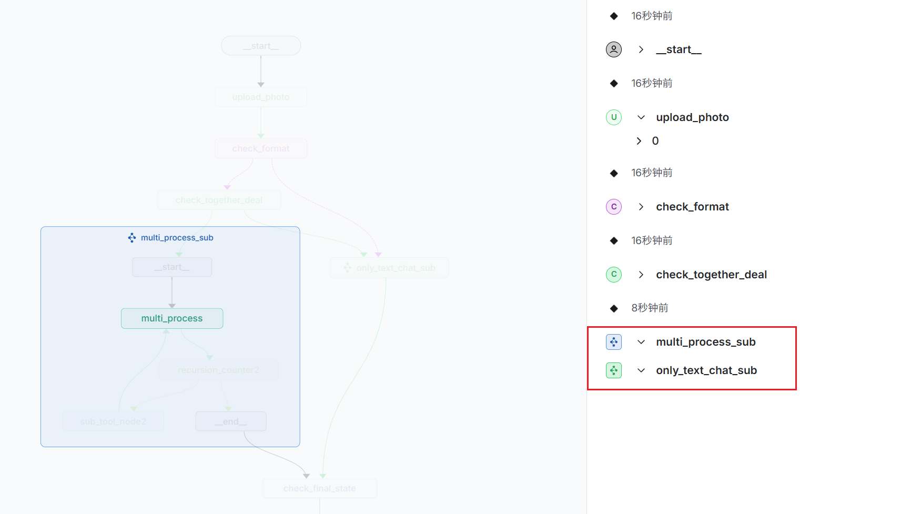
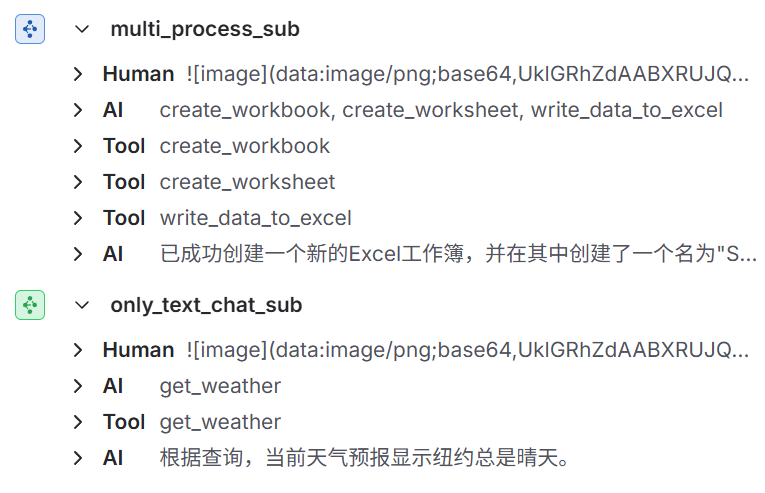
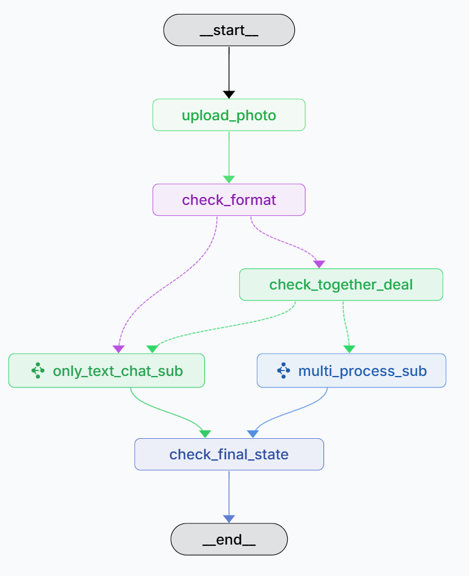
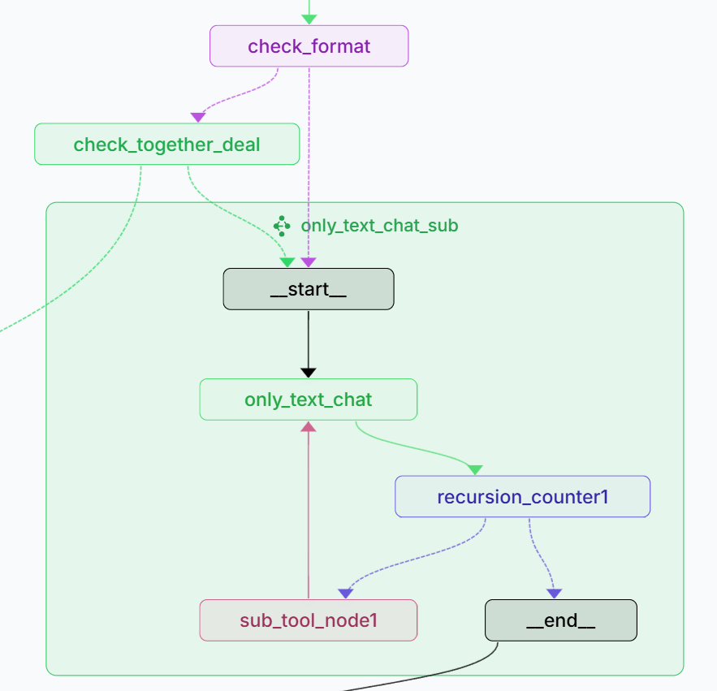
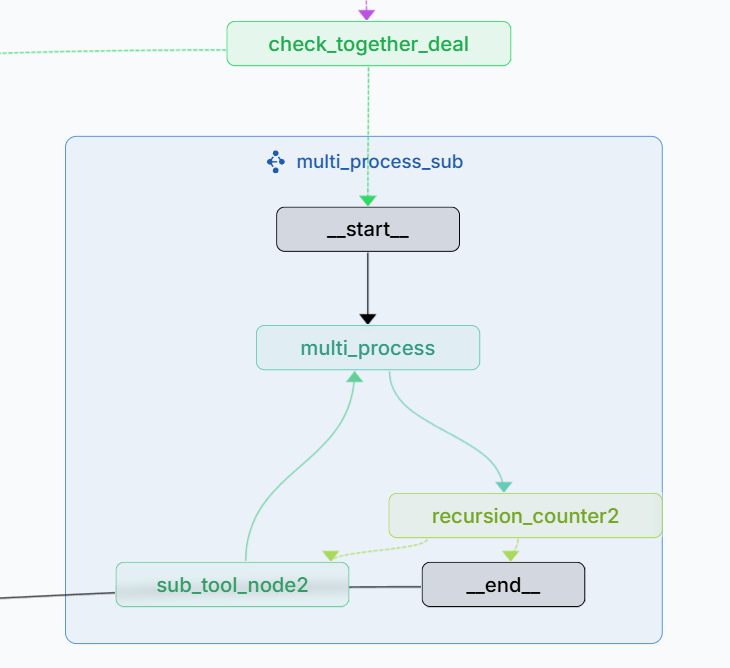

## SimpleExcelAgenWithMCP 🚀

**Read this in other languages: [English](README.md), [中文](README_ZH.md).**

### Overview🧩

⚙️An example project for multimodal agent workflows. It is compatible with OpenAI-style APIs, comes with built-in code execution and Excel tools (MCP), and supports asynchronous parallel processing as well as human-in-the-loop review.

### Features ✨

- **Compatible Model Backend**: Works with models that support the `OPENAI_API_KEY` interface ✅
- **Built-in Tools (MCP)**: Provides “code execution” and “Excel” tools for common spreadsheet scenarios such as reading images and writing tables, and performing statistical summaries 📊
- **Asynchronous Parallel Workflow**: Pure text tasks and multimodal (text + image) tasks run in parallel without blocking, improving efficiency and model utilization ⚡
- **Context Management for Small Models**: Context pruning and management tailored for smaller models while handling multimodal tasks 🧠
- **Human-in-the-Loop (LangSmith)**: Supports reviewing and intervening in tool calls 👀

### Showcase 🖼️

- **Human-in-the-loop, review tool calls**

  
- **Asynchronous processing for pure text and multimodal tasks**

  - Example task: Image + “Please read this table and write the information into an Excel sheet, then help me check the weather in Beijing.”
  - Execution result:

    - Subgraph `only_text_chat_sub` handles pure text (e.g., tells a joke);
    - Subgraph `multi_process_sub` handles the multimodal task “read table and write into Excel”;
    - Both run asynchronously in parallel for higher throughput 🔁
      

### Architecture 🧭

#### Main Graph

1. `upload_photo`: Upload an image
2. `check_format`: Validate image format
3. `check_together_deal`: Route to either pure-text or multimodal branch
4. `check_final_state`: Reset key variables

#### Subgraph 1 `only_text_chat_sub`

1. `only_text_chat`: Handle text-only queries unrelated to images
2. `recursion_counter1`: Loop counter + tool selector; if exceeded threshold or no tool needed, go to `_end__`; otherwise go to `sub_tool_node1`
3. `sub_tool_node1`: Tool call node; after completion, return to `only_text_chat`

#### Subgraph 2 `multi_process_sub`

1. `multi_process`: Handle image-text multimodal problems
2. `recursion_counter2`: Loop counter + tool selector; if exceeded threshold or no tool needed, go to `_end__`; otherwise go to `sub_tool_node2`
3. `sub_tool_node2`: Tool call node; after completion, return to `multi_process`

### Getting Started 🛠️

- **ExcelAgent**

  - Refer to `ExcelAgent/README.md`. Start with `langgraph dev`, and an interactive UI will appear in your browser.
  - Sample UI:

  
- **agent-chat-ui**

  - Not recommended for now (known issues, see [issues:166](https://github.com/langchain-ai/agent-chat-ui/issues/166)) ❗
  - If you want to try it, please check the latest progress on that issue first.
- **mcp-sever**

  * How to run excel-mcp-server-main: [EXCEL-MCP-SEVER](MCP_Server/excel-mcp-server-main/README.md)
  * How to run `math_server.py ` and `wether.py `as MCP servers:`python math_server.py ` `python wether.py`

### Configuration & Notes 📝

- In `ExcelAgent/src/utils/Connect.py`:
  - At the top of [Connect.py](ExcelAgent/src/utils/Connect.py), set your base model API key (compatible with OpenAI-style calls), base_url, model_name, and other parameters.
- In `ExcelAgent/.env`:
  - [.env](ExcelAgent/.env) Configure LangSmith settings. This step is optional.

### Recommended Models ✅

- Recommended: `qwen2.5-vl-7b-instruct`, `qwen2.5-vl-72b-instruct`
- Not recommended: `qwen2.5-vl-32b-instruct` (weaker instruction following)

### Future🧪

- Track and fix compatibility issues with `agent-chat-ui` [issues:166](https://github.com/langchain-ai/agent-chat-ui/issues/166)
- Consider flattening the graph structure to reduce overhead between main/subgraphs and improve UI interaction stability
- Improve prompts and inter-node communication to reduce ineffective iterations

### Acknowledgements 🙏

- [langchain-ai/agent-chat-ui](https://github.com/langchain-ai/agent-chat-ui)
- [langchain-ai/new-langgraph-project](https://github.com/langchain-ai/new-langgraph-project)
- [excel-mcp-server)](https://github.com/haris-musa/excel-mcp-server)

# License

[License](LICENSE)
