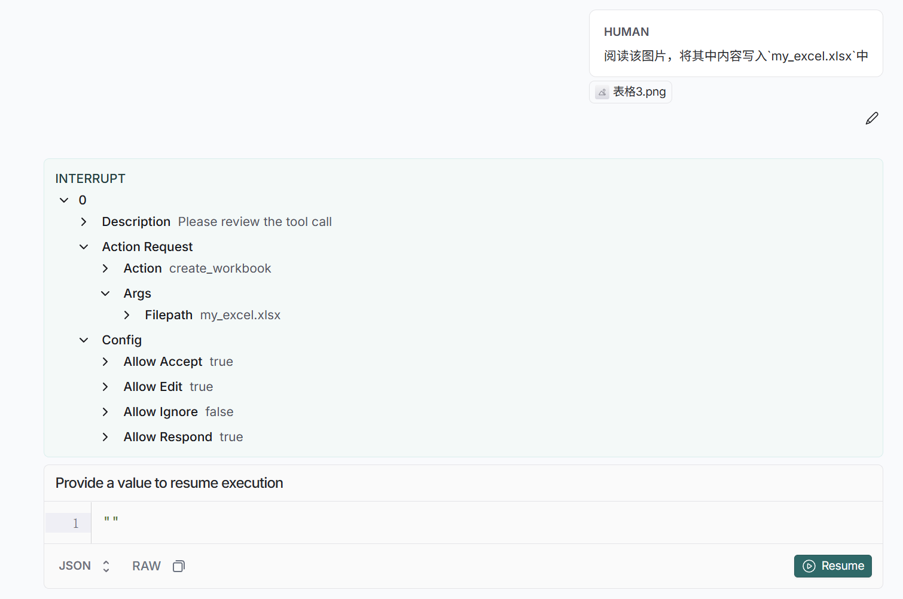
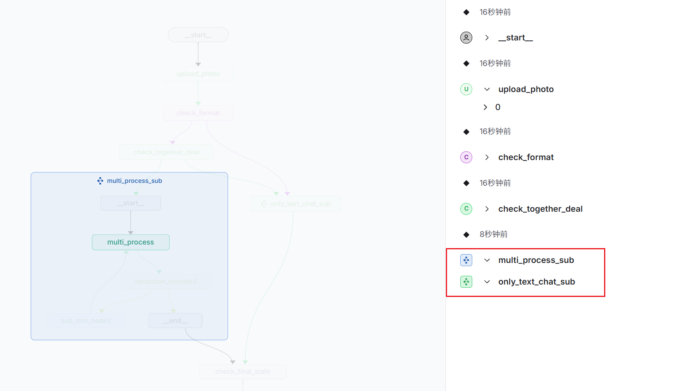
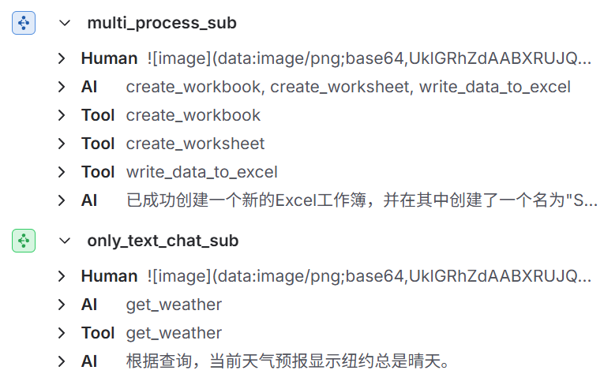
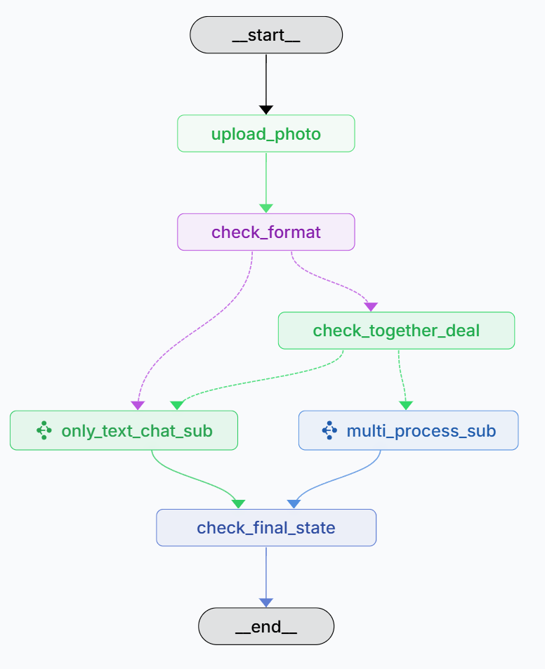
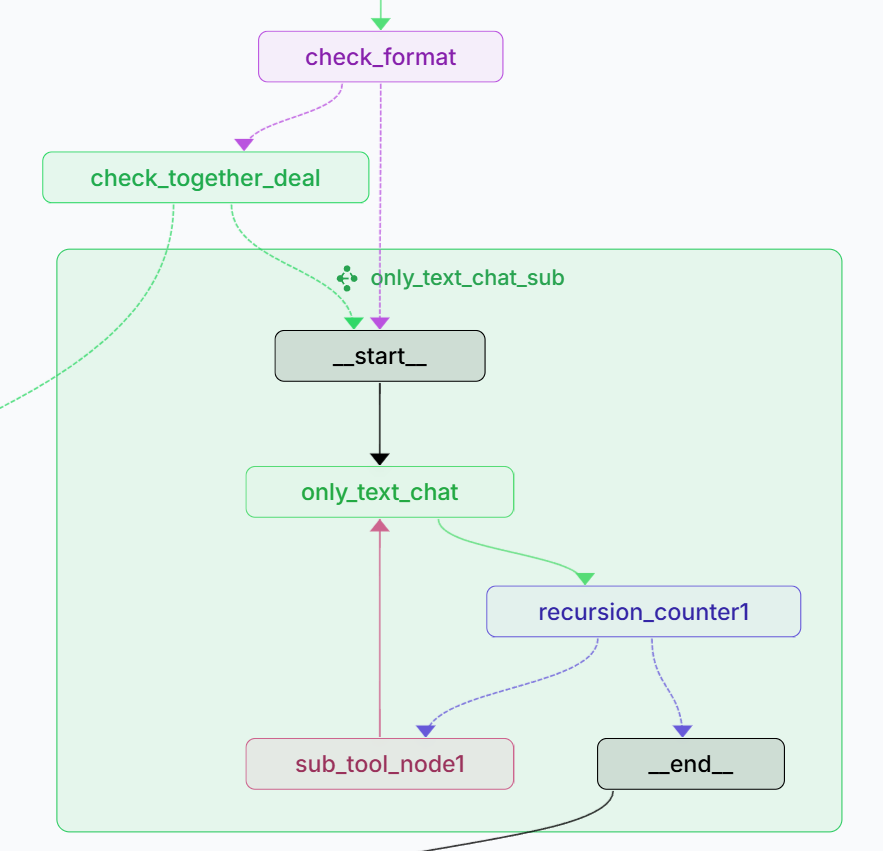
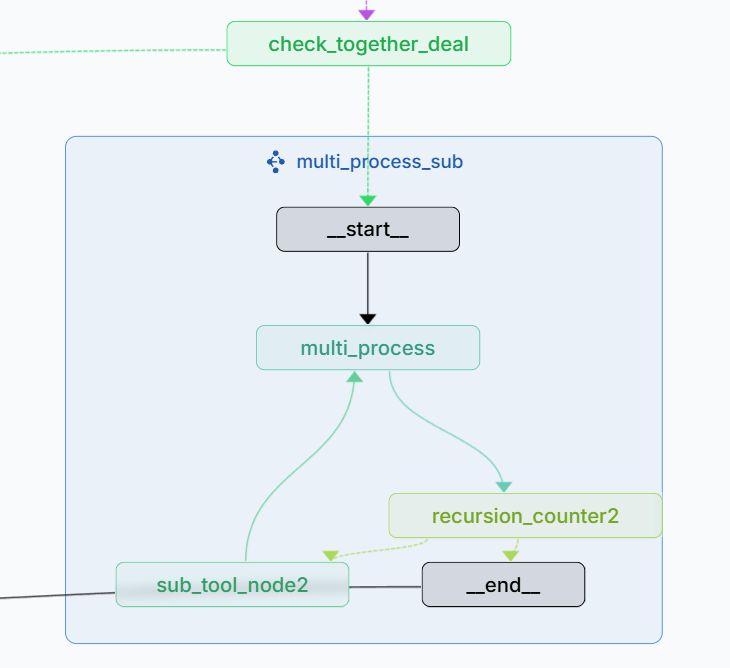
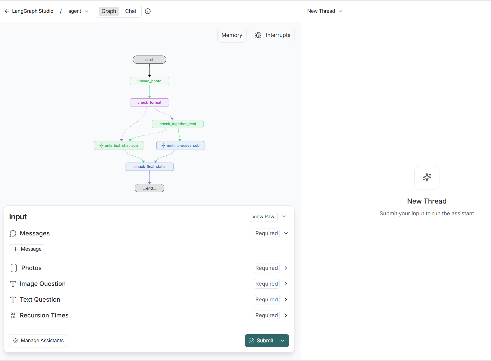

## SimpleExcelAgenWithMCP 🚀

**其他语言版本: [English](README.md), [中文](README_zh.md).**

### 概述🧩

⚙️一个面向多模态智能体工作流的示例项目，兼容 OpenAI 风格接口，内置代码执行与 Excel 工具（MCP），支持异步并行处理与人工在环审阅。

### 特性 ✨

- **兼容模型基座**：兼容 `OPENAI_API_KEY` 接口的模型作为基座 ✅
- **内置工具（MCP）**：提供“代码执行”和“Excel”工具，支持读图写表、统计汇总等常见表格场景 📊
- **异步并行工作流**：纯文本任务与图文多模态任务可并行、互不阻塞，提升效率与模型利用率 ⚡
- **小模型上下文管理**：面向小模型的上下文裁剪与管理，兼顾多模态与稳健性 🧠
- **人工在环（LangSmith）**：支持工具调用的审阅与干预 👀

### 特性展示 🖼️

- **人工在环，审阅工具调用**

  
- **异步处理纯文本与多模态任务**

  - 示例任务：图片 + “请阅读该表格，将其中信息写入 Excel，然后帮我查询北京的天气”
  - 运行效果：

    - 子图 `only_text_chat_sub` 处理纯文本（如讲个笑话）；
    - 子图 `multi_process_sub` 处理“读表格并写入 Excel”的多模态任务；
    - 两者异步并行，提高效率 🔁
      

### 结构 🧭

#### 主图

1. `upload_photo`：上传图片
2. `check_format`：检查图片格式
3. `check_together_deal`：分流纯文本与多模态任务
4. `check_final_state`：重置关键变量

#### 子图一 `only_text_chat_sub`

1. `only_text_chat`：处理与图片无关的文本问答
2. `recursion_counter1`：循环计数与工具选择；超过阈值或无需工具时转 `_end__`，否则进入 `sub_tool_node1`
3. `sub_tool_node1`：工具调用节点；调用后返回 `only_text_chat`

#### 子图二 `multi_process_sub`

1. `multi_process`：处理图文多模态问题
2. `recursion_counter2`：循环计数与工具选择；超过阈值或无需工具时转 `_end__`，否则进入 `sub_tool_node2`
3. `sub_tool_node2`：工具调用节点；调用后返回 `multi_process`

### 启动 🛠️

- **ExcelAgent**

  - 参考 `ExcelAgent/README.md`，使用 `langgraph dev` 启动，浏览器将出现可交互界面。
  - 示例界面：

  
- **agent-chat-ui**

  - 暂不推荐（存在已知问题，参考 [issues:166](https://github.com/langchain-ai/agent-chat-ui/issues/166)）❗
  - 若需尝试，请先关注该 issue 的最新进展后再启动。
- **mcp-sever**

  - `excel-mcp-server-main`的运行方法:[EXCEL-MCP-SEVER](MCP_Server/excel-mcp-server-main/README.md)
  - `math_server.py` 和 `wether.py`作为mcp的运行方法: `python math_server.py` `python wether.py`

### 配置与注意事项 📝

- 在 `ExcelAgent/src/utils/Connect.py` 中配置：
  - 多模态模型 API Key（兼容 OpenAI 风格调用）可在 [Connect.py](ExcelAgent/src/utils/Connect.py) 代码最前方填写你的基座模型API、base_url、model_name等参数。
- 在 `ExcelAgent/.env` 中进行LangSmith 配置 [.env](ExcelAgent/.env)
  - 可省略

### 推荐模型 ✅

- 推荐：`qwen2.5-vl-7b-instruct`、`qwen2.5-vl-72b-instruct`
- 不推荐：`qwen2.5-vl-32b-instruct`（指令遵循较弱）

### 规划与后续 🧪

- 跟进修复 `agent-chat-ui` 的兼容问题（[issues:166](https://github.com/langchain-ai/agent-chat-ui/issues/166)`）
- 尝试将图结构扁平化，减少主图/子图交流负担，提升与现有 UI 的交互稳定性
- 优化提示词与节点间沟通，减少无效迭代

### 致谢 🙏

- [langchain-ai/agent-chat-ui](https://github.com/langchain-ai/agent-chat-ui)
- [langchain-ai/new-langgraph-project](https://github.com/langchain-ai/new-langgraph-project)
- [excel-mcp-server)](https://github.com/haris-musa/excel-mcp-server)

# License

[License](LICENSE)
